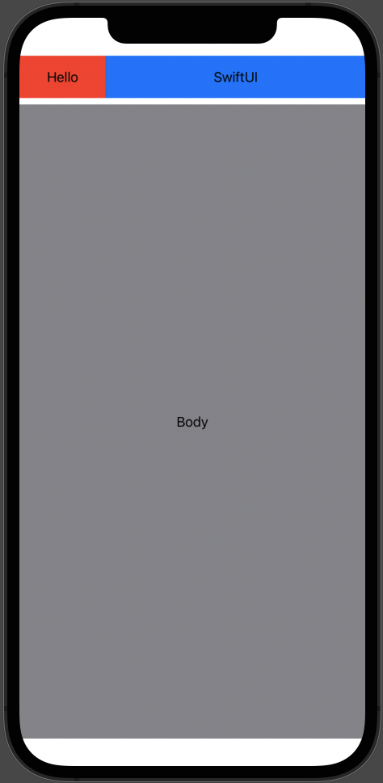

# HuggingGeometryReader

HuggingGeometryReader is a SwiftUI package that has a different sizing behavior then the official `GeometryReader`.

<br>

## The problem

We use `GeometryReader` to find out view's size. However, `GeometryReader` attempts to **match the parent size**, as indicated in the comments for GeometryReader:

```
This view returns a flexible preferred size to its parent layout.
```

This is sometimes not what we want, for example:

If we want to get the height of a `Text` as below


And with the origional `GeometryReader`, we might try something like this:

``` swift
GeometryReader { proxy in
    Text("Hello, height is \(proxy.size.height)")
        .padding()
        .background(Color.green)
}
.background(Color.red) // Just for showing GeometryReader's layout
```

But the result would be something like this:


The size we get is actually the red part, that's not what we want. Also, the `GeometryReader` occupies the whole screen and breaks the layout.

<br>

## A simple example

This package solves the above problems with simple usage:

``` swift
HuggingGeometryReader { size in
    Text("Hello, height is \(size.height)")
        .padding()
        .background(Color.green)
}
.background(Color.red) // Just for showing GeometryReader's layout
```

This code will have the result of the first image above.

<br>


# Installation

## Swift Package Manager

- Repository URL: `https://github.com/chihsuanwu/HuggingGeometryReader`

<br>


# Usage

## HuggingGeometryReader

Use like the official GeometryReader, the closure has a `CGSize` parameter provides the size of the child view.

``` swift
HuggingGeometryReader { size in
    // Child Contents
}
```

An `onChange` closure is also provided to perform actions when the size changes, which is useful when passing the size to parent views or viewmodel.

``` swift
HuggingGeometryReader(onChange: { newSize in
    // Do something when size changes
}) { size in
    // Child Contents
}
```

If you only need to pass the size to parent view, you can use the `readGeometry` modifier:

``` swift
Text("Hello") // Child contents that need to be measured
    .readGeometry { newSize in
        // Do something when size changes
    }

```

<br>

## HorizontalGeometryReader

There are also two variation of HuggingGeometryReader: `HorizontalGeometryReader` and `VerticalGeometryReader`.

These two containers has different sizing behavior in horizontal and vertical axes, and the parameter passed into the closure is the size of the expanding axes.
For example, `HorizontalGeometryReader` is **Expanding** at horizontal axes, and **Hugging** in vertical axes, and the closure's parameter is the width of the container.

A common use case is to build a percentage layout:


``` swift

HorizontalGeometryReader { width in
    HStack(spacing: 0) {
        // 25% width of the container
        Text("Hello")
            .padding()
            .frame(width: width * 0.25)
            .background(Color.red)
        
        // 75% width of the container
        Text("SwiftUI")
            .padding()
            .frame(width: width * 0.75)
            .background(Color.blue)
    }
}

```
<br><br><br><br><br>

<br>

The official `GeometryReader` can also do this, but the expaning behavior sometimes break the layout, especially when we seperate the GeometryReader into a child view, for example:


``` Swift
// define a header view
var header: some View {
    // With origional GeometryReader
    GeometryReader { proxy in
        HStack(spacing: 0) {
            // Percentage Layout as above...
        }
    }
}

// use header view as child view
VStack {
    header // this view contains a GeometryReader
    
    VStack {
        Text("Body")
    }
    .frame(maxWidth: .infinity, maxHeight: .infinity)
    .background(Color.gray)
}
```

The result shows that the header view occupies the half of the screen because of the **Expanding** behavior of the `GeometryReader`.

<br><br>

Using the `HorizontalGeometryReader`, which has the Hugging behavior in vertical axes:




<div style="height:480px">

``` Swift
// define a header view with HorizontalGeometryReader
var header: some View {
    HorizontalGeometryReader { width in
        HStack(spacing: 0) {
            // Percentage Layout as above...
        }
    }
}

// use header view as child view
VStack {
    header // this view contains a HorizontalGeometryReader
    
    VStack {
        Text("Body")
    }
    .frame(maxWidth: .infinity, maxHeight: .infinity)
    .background(Color.gray)
}
```

The result is as we expect.

</div>

<br><br>

## VerticalGeometryReader

Like `HorizontalGeometryReader` but the layout behavior of the X and Y axes is reversed

```Swift
VerticalGeometryReader { height in
    VStack(spacing: 0) {
        Text("Hello")
            .padding()
            .frame(height: height * 0.25)
            .background(Color.red)
        
        Text("SwiftUI")
            .padding()
            .frame(height: height * 0.75)
            .background(Color.blue)
    }
}
```


<br>

# Side effect

Note that `HuggingGeometryReader`'s hugging layout behavior has some potential side effects.
A common problem is if the child layout changes based on the size provided by the `HuggingGeometryReader`, it can cause an infinite loop. So please be careful when using `HuggingGeometryReader`'s size directly to layout child views.  


# Contribution

Any contributions are welcome.